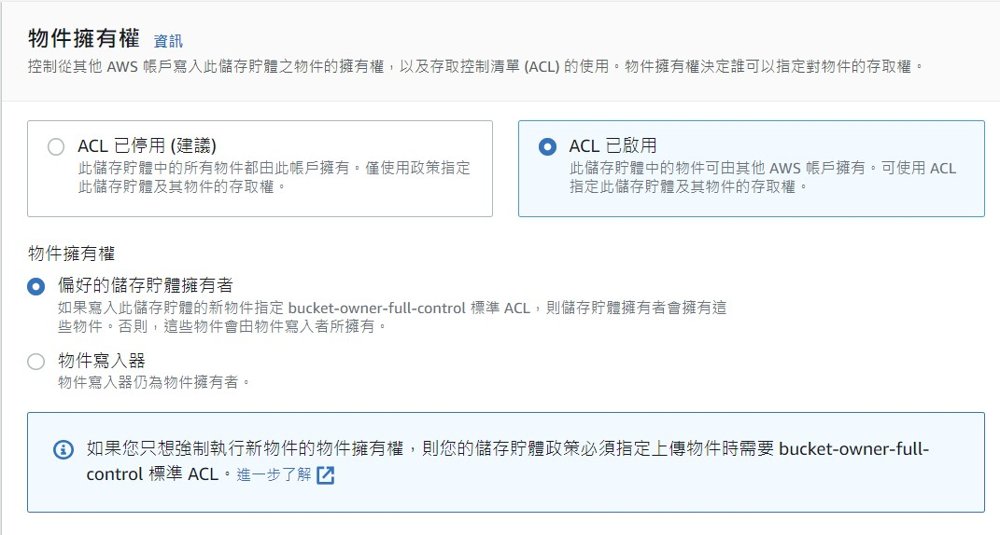

AWS Resource Tutorial - S3
===
#### Author: Grace Kuo | Date: 2022-11-01


### 1. 定義 Definition
- S3: Simple Storage Service 的縮寫，可以將 Amazon S3 視為「儲存貯體 + 物件 + 金鑰 + 版本 」
- 儲存貯體 Bucket: 存放物件的容器，可以在儲存貯體中存放任意數目的物件，並且帳戶中最多可有 100 個儲存貯體
- 物件 Object: 由物件資料與中繼資料構成。中繼資料是一組成對的名稱與數值，會說明該物件。其中包含一些預設中繼資料 (如上次修改日期) 以及標準 HTTP 中繼資料 (如 Content-Type)
- 金鑰 key: 物件金鑰 (或金鑰名稱) 是儲存貯體內的物件的唯一識別符
- 版本 Version: 當啟用版本控制時，S3 會為所有新增至儲存貯體的物件提供唯一的版本 ID

### 2. 儲存體類別 Storage classes
根據使用場景，挑選不同的儲存體類型來存貯資料以達費用的最大化使用。

|| S3 標準 | S3 智慧型分層* | S3 標準 – IA   | S3 單區域 – IA†  | S3 Glacier Instant Retrieval  | S3 Glacier Flexible Retrieval | S3 Glacier Deep Archive |
|-------------------------|------|--------|----------|--------------|---------|----------|----------|
|專為耐用性而設計|99.999999999%<br>(11 9’s)|99.999999999%<br>(11 9’s)|99.999999999%<br>(11 9’s)|99.999999999%<br>(11 9’s)|99.999999999%<br>(11 9’s)|99.999999999%<br>(11 9’s)|99.999999999%<br>(11 9’s)|
|專為可用性而設計|99.99%|99.99%|99.99%|99.99%|99.99%|99.99%|99.99%|
|可用性 SLA|99.99%|99.99%|99.99%|99.99%|99.99%|99.99%|99.99%|
|可用區域|≥3|≥3|≥3|1|≥3|≥3|≥3|
|每個物件的最低容量費用|無|無|128 KB|128 KB|128 KB|40 KB|40 KB|
|最短儲存持續時間費用|N/A|N/A|30 天|30 天|90 天|90 天|180 天|
|擷取費用|N/A|無|每 GB 擷取|每 GB 擷取|每 GB 擷取|每 GB 擷取|每 GB 擷取|
|第一位元組延遲|毫秒|毫秒|毫秒|毫秒|毫秒|**分鐘或小時**|**小時**|
|儲存體類型|物件|物件|物件|物件|物件|物件|物件|
|生命週期轉換|是|是|是|是|是|是|是|
|備註|一般用途<br>適合各種使用案例，包含雲端應用程式、動態網站、內容分配、行動與遊戲應用程式，以及大數據分析|未知或變更中存取<br>針對經常、不常和封存即時存取方案中經常、不常和很少存取的資料，提供毫秒級延遲和高輸送量效能，會監控存取模式自動將物件存放在三個存取方案(較低成本)|不常存取<br>適用於不常存取但需要在必要時進行快速存取的資料，適合長期儲存、備份和做為災難復原檔案的資料存放區使用 |不常存取<br>不常存取但需要在必要時進行快速存取的資料，它會將資料存放到單一 AZ 中，而且成本較 S3 標準 – IA 減少 20%|封存<br> 資料每季度存取一次，為很少存取且需要在幾毫秒內擷取的長期資料提供最低成本的儲存，例如醫學影像、新聞媒體資產或使用者產生的內容封存|封存<br> 每年存取 1-2 次且非同步擷取的封存資料|封存<br>最低成本儲存類別，支援長期保留和數位保留一年存取一或兩次的資料，例如金融服務，醫療保健和公共部門 – 其資料集需要保留 7 到 10 年或更長時間，以符合法規合規要求，可在 12 小時內還原|

- 可用性 Availability: 物件是否能成功取回
- 耐久性 Durability: 物件是否損毀或故障

### 3. 存取權限 Access management 

>對外防線

- 封鎖公開存取 Block Public Access: 預設新的儲存貯體、存取點和物件不允許公開存取
<center>

</center>

- 存取控制清單 ACL(access control list): 儲存貯體和物件皆可設定的存取許可資訊清單

1. 儲存貯體的ACL設定
<center>

</center>
2. 物件的ACL設定
<center>

</center>

- 儲存貯體政策 Bucket Policy: 只有儲存貯體擁有者可建立政策與儲存貯體的關聯。連接到儲存貯體的許可會套用至儲存貯體擁有者帳戶擁有的所有儲存貯體物件，以 JSON 為基礎的存取政策語言。可以限制IP、多AWS帳號、唯讀許可給匿名使用者、特定HTTP、特定MFA等的設定。例圖是IP限制的。

<center>

</center>


- 跨來源資源分享 CORS: 使用 JSON 建立 CORS 組態，最多可以將 100 條規則，在bucket的permission下面

<center>

</center>

>對內防線

- 使用者政策 IAM:  JSON 為基礎的存取政策語言

<center>

</center>


### 4. 加密 Security

- 伺服器端加密 Server-side encryption: S3 會在將物件層級的資料寫入資料中心的磁碟時加密資料，並在您存取資料時解密資料
    - 受管金鑰 (SSE-S3)
    - Key Management Service (SSE-KMS) 中的 KMS 金鑰:AWS定期輪換的根金鑰自行加密金鑰
    - 客戶提供金鑰 (SSE-C): 我們負責管理加密金鑰

<center>

</center>

- 用戶端加密 Client-side encryption:在本機加密資料的動作，S3 服務收到我們加密的資料，
    -  使用存放在 AWS KMS 中的 KMS 金鑰
    - 使用存放在您應用程式中的金鑰

### 5. 版本控制 Version control

- 版本 Version: 像Git一樣讓每一個物件都可以有自己的版本控制，避免誤刪或是想要還原設定時可以把想要的版本調整過來，儲存貯體可以是以下三種狀態:
    - 未進行版本控制 (預設)
    - 已啟用版本控制:啟用版本控制時，提供唯一的版本 ID
    - 已暫停版本控制
<center>

</center>

- MFA Delete: 使用 S3 版本控制時，可以選擇將儲存貯體設定為啟用 MFA (多重因素認證) Delete，來增加額外的安全性。要求同時使用兩種形式的身分驗證:
    - 安全憑證
    - 核准的身分驗證設備上顯示的有效序號、空格和六位代碼組合
- 物件鎖定 Object Lock: 透過物件鎖把刪除功能給鎖住，若啟用這個就不能啟用版本控制
<center>

</center>

### 6. 資源使用 How to use the resource 
- Bucket Name 命名原則: 在所有 Amazon S3 中都為唯一。長度必須介於 3 與 63 個字元之間。不含大寫字元。以小寫字母或數字開頭。建立儲存貯體後，便無法變更其名稱
- 刪除儲存貯體: 必須首先將其清空，從而刪除其中的所有物件
- 若bucket和object皆為公開，可以使用物件URL直接取得object ex: https://summer-test.s3.ap-northeast-1.amazonaws.com/favicon.ico

### 7. 實際案例 Practical cases
>#### 系統監控: 
前端畫面使用S3的靜態網站託管方式，以前後端分離開發，前端以Vue.js開發打包後直接放在該帳號的公開bucket下即顯示網站。 http://set-master-monitor.s3-website-ap-northeast-1.amazonaws.com/#/login

<center>

</center>

>#### i 珍食
門市SC將每次交易更新的i珍食庫存差份檔案(txt)上傳AWS的S3桶子，資料一進桶子後即觸發lambda進行資料解析。

>#### 統計主機
門市SC每天將保守維護檔案上傳至PGM主機後，轉拋至AWS上統計主機帳號中的bucket，每天早上八點半定時將S3桶子裡的資料於EC2裡面解析資料進PostgreSQL(RDS)，並將結果顯示於統計主機網頁上供各區會計查看。
http://statistics.ptc-nec.com/login

<center>

</center>


### 8. 動手做 Workshop 
>#### 靜態網頁託管 Static website

- Step 1 創建Bucket，此名稱就是到時候網站url所顯示的 
<center> 

</center>

- Step 2 將儲存體和物件公開
<center> 

</center>

- Step 3 啟用靜態網站託管，起始畫面:index.html，404畫面:error.html
<center> 

</center>


- Step 4 造會使用到的兩個html網頁

**index.html**
```html
<!DOCTYPE html>
<html lang="en">
<head>
    <meta charset="UTF-8">
    <meta http-equiv="X-UA-Compatible" content="IE=edge">
    <meta name="viewport" content="width=device-width, initial-scale=1.0">
    <title>s3-tutorial</title>
    <style>
        .wrapper {
  height: 100vh;
  /*This part is important for centering*/
  display: grid;
  place-items: center;
}

.s3-demo {
  width: 38ch;
  animation: typing 3s steps(30), blink 0.5s step-end infinite alternate;
  white-space: nowrap;
  overflow: hidden;
  border-right: 3px solid;
  font-family: monospace;
  font-size: 2em;
}

@keyframes typing {
  from {
    width: 0;
  }
}

@keyframes blink {
  50% {
    border-color: transparent;
  }
}

    </style>
</head>
<body>
    <div class="wrapper">
        <div class="s3-demo">
          This is a AWS S3 static website demo!
        </div>
    </div>
</body>
</html>
```
**error.html**

```html
<!DOCTYPE html>
<html lang="en">
<head>
    <meta charset="UTF-8">
    <meta http-equiv="X-UA-Compatible" content="IE=edge">
    <meta name="viewport" content="width=device-width, initial-scale=1.0">
    <title>s3-tutorial-error</title>
    <style>
        .wrapper {
  height: 100vh;
  /*This part is important for centering*/
  display: grid;
  place-items: center;
}

.s3-demo {
  width: 10ch;
  animation: typing 2s steps(20), blink 0.5s step-end infinite alternate;
  white-space: nowrap;
  overflow: hidden;
  border-right: 3px solid;
  font-family: monospace;
  font-size: 2em;
}

@keyframes typing {
  from {
    width: 0;
  }
}

@keyframes blink {
  50% {
    border-color: transparent;
  }
}

    </style>
</head>
<body>
    <div class="wrapper">
        <div class="s3-demo">
          Error.....
        </div>
    </div>
</body>
</html>
```
- Step 5 講兩個檔案上傳

<center> 

</center>
- Step 6 設定儲存貯體政策為完全公開(很重要!)
<center> 

</center>

```json
{
    "Version": "2012-10-17",
    "Statement": [
        {
            "Sid": "PublicReadGetObject",
            "Effect": "Allow",
            "Principal": "*",
            "Action": "s3:GetObject",
            "Resource": "arn:aws:s3:::s3-tutorial-staticweb/*"
        }
    ]
}
```


- Step 7 創建完畫面
<center> 

</center>

- Step 8 在 Static website hosting 下，打開 Endpoint (端點)測試網站

http://s3-tutorial-staticweb.s3-website-ap-northeast-1.amazonaws.com/

<center> 

</center>


### 9. 參考資料

[AWS S3 官方文件][1]


  [1]:  https://docs.aws.amazon.com/zh_tw/AmazonS3/latest/userguide/Welcome.
